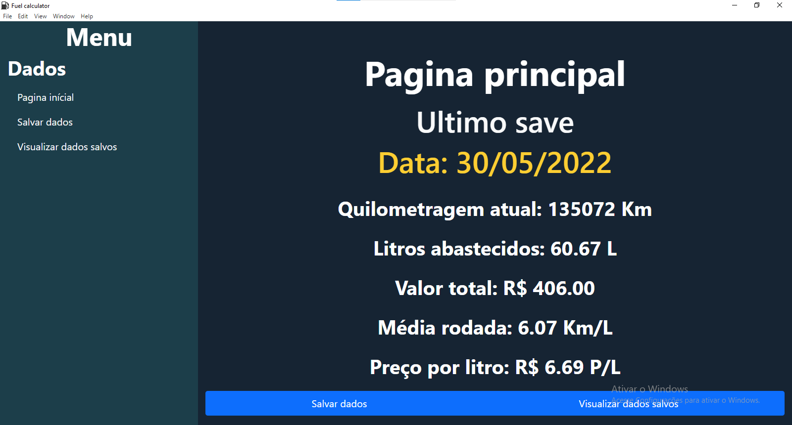
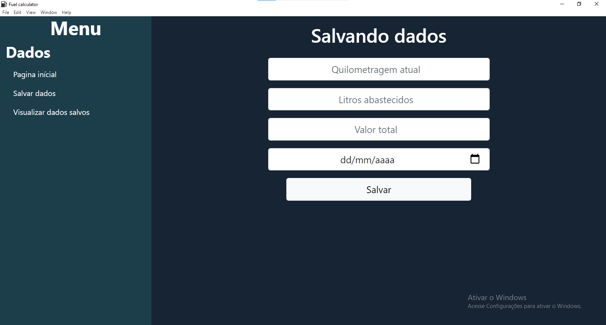
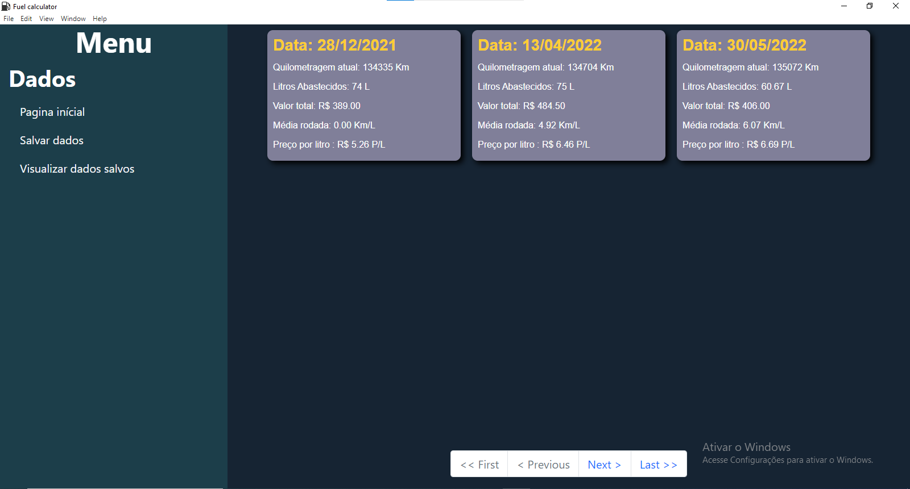

# Fuel Calculator

## Sobre

Fuel calculator foi desenvolvido para me ajudar a controlar as despesas com o gasto com combustivel, ele foi meu primeiro projeto utilizando 
electron, e me serviu como grande fonte de aprendizado.

## Como utilizar

Após instalado basta utilizar o menu "salvar dados" e depois poderá ver os seus saves no menu visualizar dados salvos.

## Imagens das outras telas

